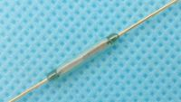

## Gas measurement
Gas meter: BK-G4T 
* Small magnet inserted on last position of counter in digit '6' - [czech trial](http://mujweb.cz/videoservis/sdsmicro.htm)

* 3d model of [Reed sensor holder](https://www.thingiverse.com/thing:1949041). You can 3d print it by [3d hubs](https://www.3dhubs.com) if you do not have 3d printer.

* Reed sensor from [Aliexpress](https://www.aliexpress.com/item/10pcs-KSK-1A-Reed-Switch-2x14mm-Green-Glass-Usually-Open-For-Sensors-100-Original/32424207994.html?spm=a2g0s.9042311.0.0.uL3Znj). Be careful, it is fragile. I destroyed 2 of them just by bending wires. 

## Google Docs
Push data to Google docs spreadsheet
[API](https://developers.google.com/sheets/api/quickstart/python)
